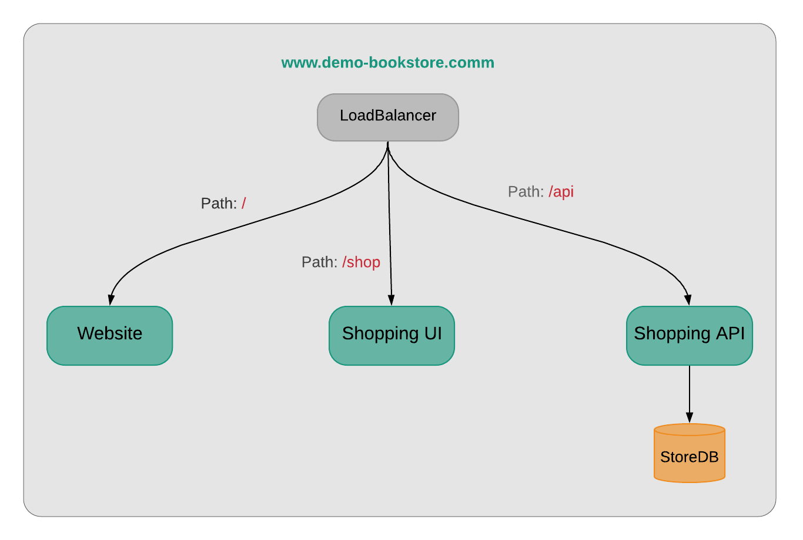

# Example Application: BookStore Services

Consists of 3 components or services

- [Website](./website/README.md): Landing page and static content
- [Shopping UI](./shop-ui/README.md): SPA build on Vue.js
- [Shopping API](./shop-api/README.md): REST JSON API for Shopping UI. API app needs a MySQL database

Refer [demo-apps-on-k8s](https://github.com/devteds/demo-apps-on-k8s) for the production deployment and kubernetes setup of these services.
